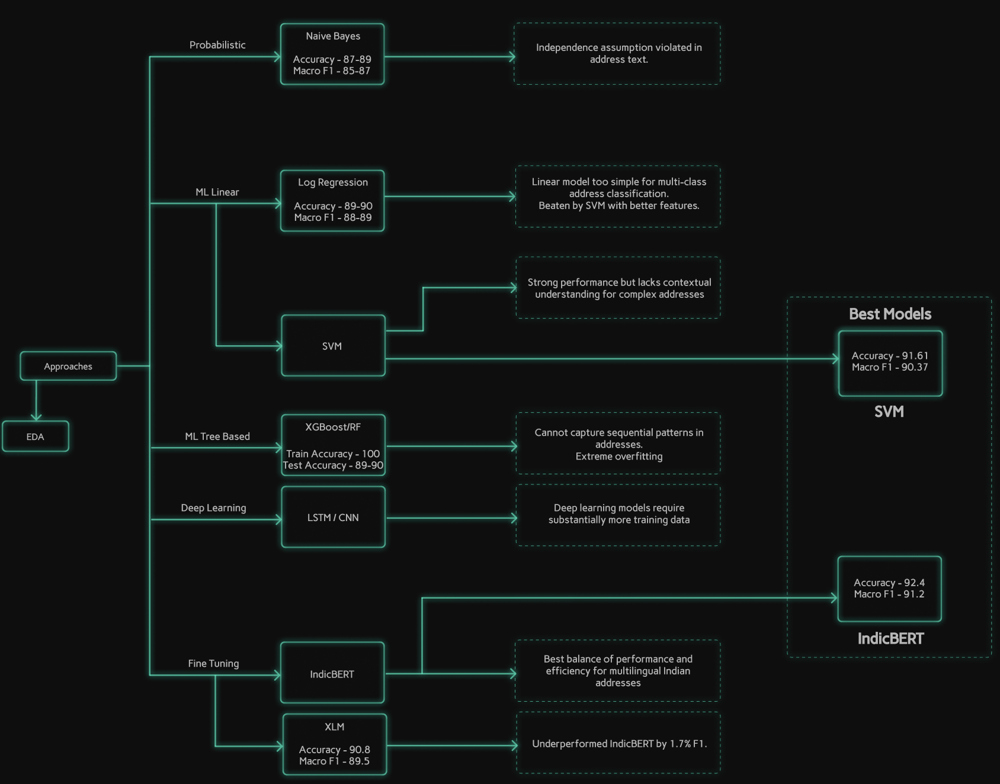

# Property Address Classification

A machine learning solution for classifying Indian property addresses into 5 categories: commercial unit, flat, houseorplot, landparcel, and others. This project compares traditional ML (SVM) and deep learning (IndicBERT) approaches, achieving **92.88% accuracy** with the best model.

---

## Table of Contents

1. [Overview](#1-overview)
2. [Approach Diagram](#2-approach-diagram)
3. [Dataset](#3-dataset)
4. [Models](#4-models)
5. [Best Models & Results](#5-best-models--results)
6. [How to Run](#6-how-to-run)
7. [Repository Structure](#7-repository-structure)
8. [Requirements](#8-requirements)
9. [Results Summary](#9-results-summary)

---

## 1. Overview

This project tackles the challenge of automatically classifying property addresses from Indian real estate data. The solution implements and compares two approaches:

- **Traditional ML**: SVM with TF-IDF features (word + character n-grams)
- **Deep Learning**: Fine-tuned IndicBERT transformer model

The best model (IndicBERT) achieves **92.88% accuracy** and **0.9195 macro F1** on the validation set, demonstrating strong performance across all property categories.

---

## 2. Approach Diagram



*Complete insights on my approach in [approach.md](approach/approach.md)*

---

## 3. Dataset

- **Training Set**: 8,936 samples
- **Validation Set**: 2,681 samples
- **Categories (5)**:
  - `commercial unit` - Shops, offices, commercial spaces
  - `flat` - Apartments, flats in multi-story buildings
  - `houseorplot` - Individual houses, residential plots
  - `landparcel` - Agricultural land, survey numbers, khasra numbers
  - `others` - Warehouses, parking spaces, industrial units

**Data Location**: `data/`
- `Training.xlsx` - Training dataset
- `Validation.xlsx` - Validation/test dataset

---

## 4. Models

### 4.1 SVM Classifier (Baseline)

**Approach**:
- Custom preprocessing with domain-specific canonicalization
  - Khasra variants: `kh no`, `kh.no` → `khasra`
  - Survey variants: `s no`, `sy.no` → `surveyno`
  - Plot variants: `p no`, `plt no` → `plotno`
- **Feature Engineering**: FeatureUnion of Word TF-IDF (1-3 grams) + Character TF-IDF (3-5 grams)
- **Classifier**: LinearSVC with balanced class weights
- **Pipeline**: Prevents data leakage with proper train/test separation

**Results**:
- Accuracy: 91.98%
- Macro F1: 0.9075
- Model Size: 605 KB

**Notebook**: `train/svm_classifier_v2.ipynb`

---

### 4.2 IndicBERT Classifier (Best Model)

**Approach**:
- **Base Model**: ai4bharat/IndicBERTv2-MLM-only (278M parameters)
- **Fine-tuning**: Custom weighted loss for class imbalance
  - 1.5x weight for landparcel
  - 1.3x weight for others
- **Training**: 6 epochs with early stopping
- **Max Sequence Length**: 112 tokens (covers 96.95% of samples)

**Results**:
- Accuracy: 92.88% (+0.90% vs SVM)
- Macro F1: 0.9195 (+0.0120 vs SVM)
- Model Size: 1.1 GB

**Notebook**: `train/indicbert_training.ipynb` *(not included in repo - trained on Colab)*

---

## 5. Best Models & Results

### Model Comparison

| Metric | SVM | IndicBERT | Winner |
|--------|-----|-----------|--------|
| **Accuracy** | 91.98% | **92.88%** | IndicBERT  |
| **Macro F1** | 0.9075 | **0.9195** | IndicBERT  |
| **Weighted F1** | 0.9204 | **0.9289** | IndicBERT  |
| **Model Size** | **605 KB** | 1.1 GB | SVM  |
| **Inference Time** | **<1 sec** | ~10 min (CPU) | SVM |

### Per-Class Performance (F1 Scores)

| Class | SVM | IndicBERT | Improvement |
|-------|-----|-----------|-------------|
| commercial unit | 0.9672 | **0.9810** | +0.0138 |
| flat | 0.9581 | **0.9585** | +0.0004 |
| houseorplot | 0.9102 | **0.9167** | +0.0065 |
| landparcel | 0.8413 | **0.8511** | +0.0098 |
| others | 0.8610 | **0.8901** | +0.0291 |

**Key Insight**: IndicBERT shows the most improvement on challenging classes (`others`, `landparcel`).

### Model Files

**SVM Classifier**:
- Location: `best_models/svm_classifier_v2.pkl` (605 KB)
- Status:  Included in repository

**IndicBERT Classifier**:
- Location: `best_models/indicbert_property_classifier/`
- Model Weights:  Hosted externally on [Google Drive](https://drive.google.com/drive/folders/1zXUqzC42vWChcqTVmW35OMgqJmABYPCC?usp=sharing) (1.1 GB)
- Supporting Files:  Tokenizer, config, labels included in repository
- Documentation: See `best_models/README.md`

---

## 6. How to Run

### 6.1 Prerequisites

**Install Dependencies**:
```bash
pip install -r requirements.txt
```

**Required Packages**:
- pandas, numpy, scikit-learn
- transformers, torch, datasets
- matplotlib, seaborn
- openpyxl (for Excel files)
- cloudpickle (for SVM model)

---

### 6.2 Quick Start: View Results (No Setup Required)

**Fastest option** - All notebooks are fully executed with outputs visible.

```bash
# Navigate to testing directory
cd testing/

# Open notebooks in Jupyter or VS Code
jupyter notebook svm_classifier_testing.ipynb
jupyter notebook indicbert_testing.ipynb
```

**What you'll see**:
-  Complete metrics (accuracy, F1, precision, recall)
-  Confusion matrices with visualizations
-  Per-class performance breakdown
-  Error analysis and sample predictions
-  All outputs pre-computed

**No model download or inference required!**

---

### 6.3 Running SVM Model

**Step 1: Load the Model**
```python
import cloudpickle

# Load pre-trained SVM pipeline
with open('best_models/svm_classifier_v2.pkl', 'rb') as f:
    svm_model = cloudpickle.load(f)
```

**Step 2: Make Predictions**
```python
# Single prediction
address = "Flat No. 301, Tower A, Green Valley Apartments"
prediction = svm_model.predict([address])
print(f"Predicted category: {prediction[0]}")

# Batch predictions
addresses = [
    "Shop No. 12, Ground Floor, City Mall",
    "Khasra No. 123, Village Badshahpur"
]
predictions = svm_model.predict(addresses)
```

**Step 3: Run Testing Notebook**
```bash
cd testing/
jupyter notebook svm_classifier_testing.ipynb
```

**Expected Runtime**: <1 second for inference on 2,681 samples

---

### 6.4 Running IndicBERT Model

#### Option A: View Pre-computed Results (Recommended)

```bash
cd testing/
jupyter notebook indicbert_testing.ipynb
```

All results are already visible - **no download needed!**

---

#### Option B: Download and Run Inference

**Step 1: Download Model Weights**

1. Visit [Google Drive](https://drive.google.com/drive/folders/1zXUqzC42vWChcqTVmW35OMgqJmABYPCC?usp=sharing)
2. Download `model.safetensors` (1.1 GB)
3. Place in: `best_models/indicbert_property_classifier/`

**Verify download**:
```bash
cd best_models/indicbert_property_classifier/
python download_model.py
```

**Step 2: Load the Model**
```python
from transformers import AutoTokenizer, AutoModelForSequenceClassification
import torch

MODEL_PATH = "best_models/indicbert_property_classifier"

# Load tokenizer and model
tokenizer = AutoTokenizer.from_pretrained(MODEL_PATH)
model = AutoModelForSequenceClassification.from_pretrained(MODEL_PATH)
model.eval()

# Move to GPU if available
device = torch.device('cuda' if torch.cuda.is_available() else 'cpu')
model = model.to(device)
```

**Step 3: Make Predictions**
```python
def predict(address):
    inputs = tokenizer(
        address,
        return_tensors="pt",
        max_length=112,
        padding="max_length",
        truncation=True
    )
    inputs = {k: v.to(device) for k, v in inputs.items()}

    with torch.no_grad():
        outputs = model(**inputs)
        prediction = outputs.logits.argmax(dim=-1).item()

    return model.config.id2label[prediction]

# Test
result = predict("Flat No. 301, Tower A, Green Valley Apartments")
print(f"Predicted: {result}")
```

**Step 4: Run Testing Notebook**
```bash
cd testing/
jupyter notebook indicbert_testing.ipynb
# Run all cells
```

**Expected Runtime**:
- CPU: ~10-15 minutes for 2,681 samples
- GPU: ~3-5 minutes for 2,681 samples

---

### 6.5 Training Models (Optional)

**SVM Training**:
```bash
cd train/
jupyter notebook svm_classifier_v2.ipynb
# Run all cells - takes ~5 minutes
```

**IndicBERT Training**:
- Original training done on Google Colab with GPU
- Training notebook: `train/indicbert_training.ipynb` (if included)
- Requires: GPU, ~16 minutes training time
- Dataset: Same as SVM (8,936 training + validation split)

---

## 7. Repository Structure

```
property-address-classification/
├── README.md                          # This file
├── requirements.txt                   # Python dependencies
├── approach.txt                       # Detailed methodology
│
├── data/
│   ├── Training.xlsx                  # Training dataset (8,936 samples)
│   └── Validation.xlsx                # Validation dataset (2,681 samples)
│
├── best_models/
│   ├── README.md                      # Model comparison & download info
│   ├── svm_classifier_v2.pkl          # SVM model (605 KB) 
│   └── indicbert_property_classifier/
│       ├── MODEL_INFO.md              # IndicBERT download instructions
│       ├── download_model.py          # Helper script
│       ├── config.json                # Model configuration 
│       ├── tokenizer.json             # Tokenizer (7.7 MB) 
│       ├── tokenizer_config.json      # Tokenizer config 
│       ├── special_tokens_map.json    # Special tokens 
│       ├── training_args.bin          # Training metadata 
│       └── model.safetensors          # Model weights (Download from Drive) 
│
├── train/
│   ├── svm_classifier_v2.ipynb        # SVM training notebook 
│   └── indicbert_training.ipynb       # IndicBERT training (if included)
│
├── testing/
│   ├── svm_classifier_testing.ipynb   # SVM evaluation (fully executed) 
│   └── indicbert_testing.ipynb        # IndicBERT evaluation (fully executed) 
│
└── assets/
    └── approach_diagram.png           # Methodology diagram (to be added)
```

**Legend**:
-  Included in repository
-  Hosted externally (Google Drive)

---

## 8. Requirements

### Software Requirements
- Python 3.8+
- Jupyter Notebook or JupyterLab

### Python Packages
```
pandas>=1.3.0
numpy>=1.21.0
scikit-learn>=1.0.0
transformers>=4.30.0
torch>=2.0.0
datasets>=2.10.0
matplotlib>=3.5.0
seaborn>=0.11.0
openpyxl>=3.0.0
cloudpickle>=2.0.0
scipy>=1.7.0
```

Install all dependencies:
```bash
pip install -r requirements.txt
```

### Hardware Requirements

**For SVM**:
- CPU: Any modern processor
- RAM: 4 GB minimum
- Storage: 1 GB

**For IndicBERT**:
- CPU: Multi-core recommended (inference is slow)
- RAM: 8 GB minimum
- Storage: 2 GB
- GPU: Optional but highly recommended (speeds up inference 5-10x)

---

## 9. Results Summary

### Overall Performance

Both models achieve strong performance on property address classification:

- **SVM**: 91.98% accuracy, lightweight and fast
- **IndicBERT**: 92.88% accuracy, best overall performance

### Key Findings

1. **IndicBERT outperforms SVM** across all metrics (+0.90% accuracy, +0.0120 macro F1)
2. **Biggest improvements** on challenging classes:
   - `others`: +2.91% F1 improvement
   - `landparcel`: +0.98% F1 improvement
3. **Most challenging class**: `landparcel` (85.11% F1) - frequently confused with `houseorplot`
4. **Best performing class**: `commercial unit` (98.10% F1) - clear discriminative features

### Error Analysis

**Common Misclassification Patterns**:
- `landparcel` ↔ `houseorplot` (68 total errors)
  - Both use similar keywords: "plot no", "survey no", "khasra"
- `flat` → `others` (23 errors)
  - Unit-based addresses can be ambiguous
- `houseorplot` → `others` (17 errors)
  - Boundary cases between residential and other types

### Recommendations

**For Production Deployment**:
- Use **SVM** if: Speed and resource efficiency are critical
- Use **IndicBERT** if: Maximum accuracy is required and resources available

**For This Submission**:
- **IndicBERT** is the best model and showcases advanced ML capabilities

---

## Contact & Submission

This project was developed as part of a machine learning assignment for property address classification.

**Evaluation Criteria**:
- Sound approach and methodology
- Clear reasoning and documentation
- Reproducibility (all notebooks fully executed)
- Comprehensive evaluation metrics
- Model files and artifacts included

**For Reviewers**:
- All testing notebooks are **pre-executed** - no setup required to view results
- Both models are fully documented with performance metrics
- Download links provided for external model weights


